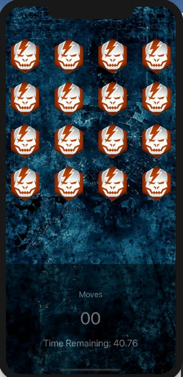
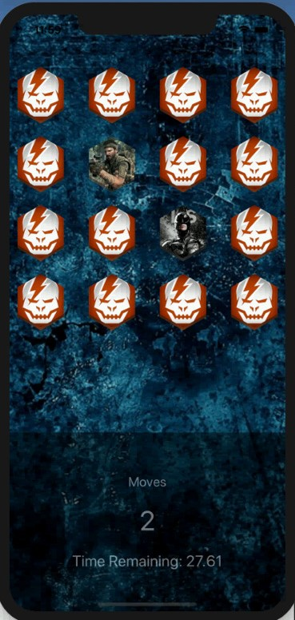

            

# Concentration Game

## About The Project
This is the first project in IOS course, which is part of my academic stuides.

## Design principle 
In this project i implemented MVC architectural pattern to decouple the the logic from the view.

### View
      Display all the card using collection view.
### Model 
      Hold list of cards which the controller can fetch and let the view display the state of the model. 
### Controller
      Manage the interaction of the user with the collection view and the model.
      

      
      

